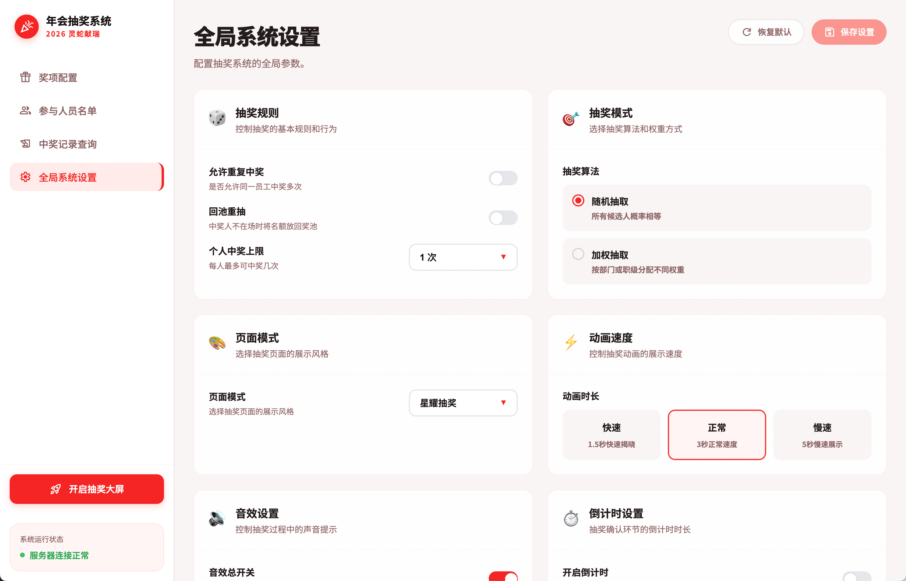
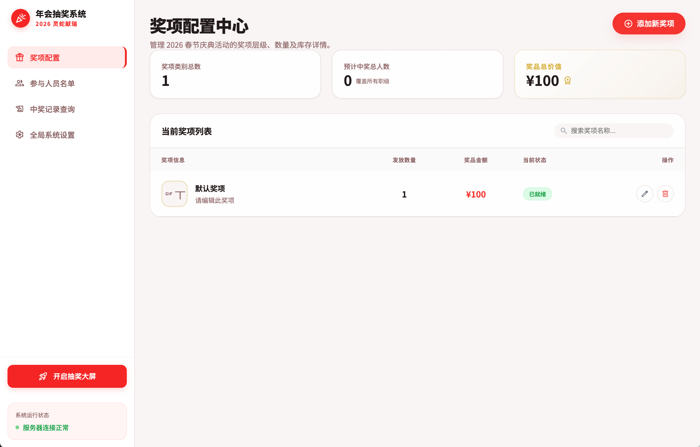

# 年终抽奖系统

一个功能完善的年会抽奖系统,提供多种炫酷的抽奖动画效果和便捷的后台管理功能。

## 功能特性

**抽奖展示**
- 🎯 3D 球体滚动抽奖效果
- 🎨 时尚动感抽奖动画
- 🐴 一马当先特效抽奖
- 🎊 彩带庆祝效果
- 🔊 音效支持(开始/结束音效)
- 🇩🇰 弹幕

**后台管理**
- 📋 参与者管理(支持 Excel 导入)
- 🏆 奖项配置
- 📊 抽奖记录查看
- ⚙️ 系统设置
- 📈 数据统计

## 截图预览

### 后台管理




### 抽奖界面


## 快速开始

### 安装依赖

使用 npm:
```bash
npm install
```

或使用 pnpm:
```bash
pnpm install
```

### 启动开发服务器

```bash
npm run dev
```

访问 `http://localhost:5173` 查看抽奖页面。

访问 `http://localhost:5173/backend` 进入后台管理。

### 构建生产版本

```bash
npm run build
```

构建后的文件在 `dist` 目录,可直接部署到静态服务器。

## 使用说明

### 配置参与者

1. 访问后台管理页面 `/backend`
2. 在**参与者管理**页面,点击**导入 Excel** 按钮
3. 上传包含参与者信息的 Excel 文件
4. 系统自动导入并显示参与者列表

### 配置奖项

1. 在后台的**奖项配置**页面
2. 添加奖项名称、数量、图片等信息
3. 保存配置

### 开始抽奖

1. 访问抽奖页面 `/`
2. 选择奖项和抽奖动画效果
3. 点击开始按钮进行抽奖
4. 抽奖结果会自动保存到记录中

### 查看记录

在后台的**抽奖记录**页面可以查看所有历史抽奖记录。

## 技术栈

- **Vue 3** - 渐进式 JavaScript 框架
- **Vite** - 下一代前端构建工具
- **Vue Router** - 官方路由管理器
- **Three.js** - 3D 图形库
- **Canvas Confetti** - 彩带动画效果
- **XLSX** - Excel 文件处理

## 项目结构

```
yearEndLuckyDraw/
├── doc/                    # 文档和截图
├── public/                 # 静态资源
│   ├── audio/             # 音效文件
│   ├── images/            # 图片资源
│   └── madaocgong/        # 一马当先特效资源
├── src/
│   ├── components/        # 通用组件
│   ├── router/            # 路由配置
│   ├── utils/             # 工具函数
│   │   ├── lotteryAlgorithm.js  # 抽奖算法
│   │   └── lotteryStorage.js    # 数据存储
│   └── view/
│       ├── draw/          # 抽奖页面
│       │   ├── DrawIndex.vue       # 抽奖主页
│       │   ├── Sphere3DScreen.vue  # 3D球体抽奖
│       │   ├── TrendyScreen.vue    # 时尚抽奖
│       │   └── YimaScreen.vue      # 一马当先抽奖
│       ├── components/    # 后台组件
│       └── BackendApp.vue # 后台管理主页
├── index.html
├── package.json
└── vite.config.js
```

## 浏览器支持

支持所有现代浏览器:
- Chrome (推荐)
- Firefox
- Safari
- Edge

建议使用最新版本以获得最佳体验。

## 开发建议

**添加新的抽奖效果**
1. 在 `src/view/draw/` 目录创建新的屏幕组件
2. 实现抽奖动画逻辑
3. 在路由中注册新组件

**自定义主题**
修改 `src/style.css` 和各组件的样式来自定义界面主题。

**数据持久化**
默认使用 localStorage 存储数据。如需使用后端服务,修改 `src/utils/lotteryStorage.js` 中的存储逻辑。

## 许可证

MIT
